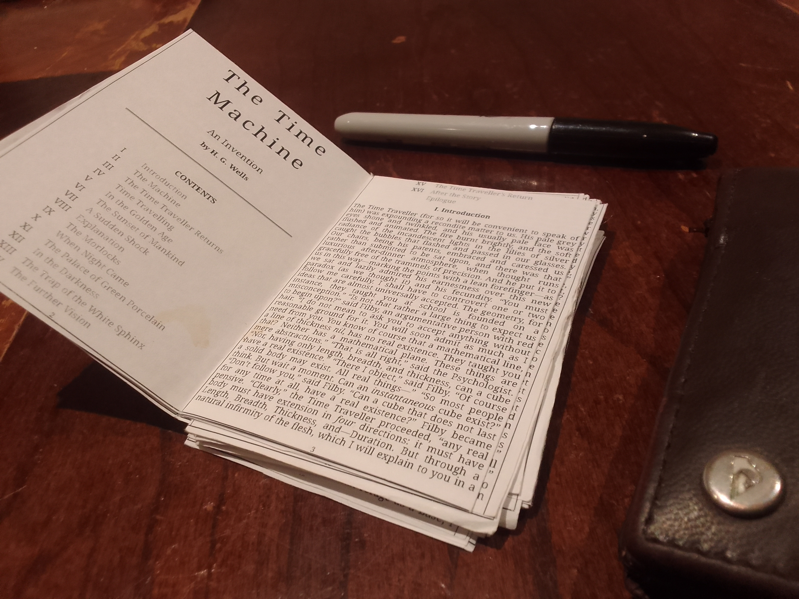
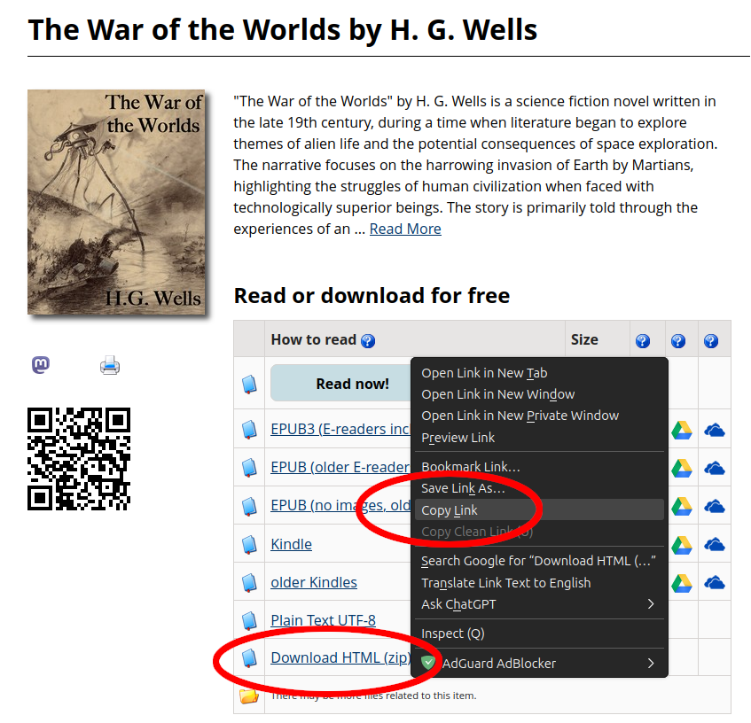
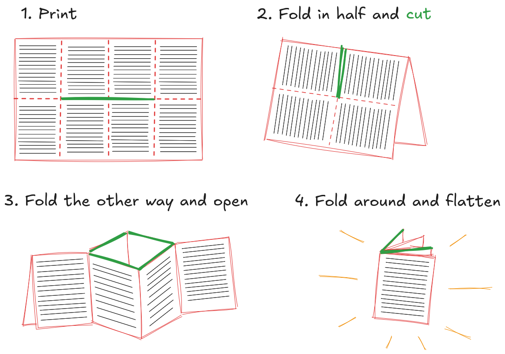

# PocketBook - Print & fold your own pocket-sized Gutenberg classics

Turn Project Gutenberg books into very compact versions, to print on standard A4, fold to pocket size, and carry around to read anywhere.

The python script downloads the html version of a Project Gutenberg book and converts it into a pdf with minimised margins, tiny font size, no page breaks etc to fit as much text on paper as possible.

The minified pages are arranged to be printed on standard office paper and folded into a booklet the size of a credit card.



---

## Sample books

The [books](books/) directory contains a few books ready to print (see below for folding instructions)


- [Lewis Carroll: Alice's Adventures in Wonderland](books/Alice_s_Adventures_in_Wonderland-booklet.pdf)
- [HG Wells: The War of the Worlds](books/The_War_of_the_Worlds-booklet.pdf)
- [Marcus Aurelius: Meditations](books/Meditations-booklet.pdf)
- [Fyodor Dostoyevsky: Notes from the Underground](books/Notes_from_the_Underground-booklet.pdf)

---


## Make your own pocket book

### Install

Clone the repository

```
git clone git@github.com:sieste/pocketbook.git
cd pocketbook
```

Create a python virtual environment and install required libraries

```
python -m venv venv
source venv/bin/activate
pip install -r requirements.txt
```

### Run

Copy the book's "Download HTML (zip)" url from Project Gutenberg:



Run the python script on the download link:

```
./pocketbook.py https://www.gutenberg.org/cache/epub/36/pg36-h.zip

## Extracted to: /tmp/tmpzpp6533v
## Creating pdf /tmp/tmpzpp6533v/pg36-images.pdf
## Done.
## Creating booklet ...
## Booklet PDF created: The_War_of_the_Worlds-booklet.pdf
```

(Alternatively, download the zip file and run the script on the local file `./pocketbook.py path/to/downloaded/pg36-h.zip`)

### Print & Fold

Print out on regular A4 office paper (one- or two-sided) and cut & fold each page using the "zine fold" technique:



(Printing two-sided creates smaller books but you have to re-fold after reading 8 pages.)

---

## License

- [MIT License](LICENSE)
- [Gutenberg Project: Permissions, Licensing and other Common Requests](https://www.gutenberg.org/policy/permission.html)


